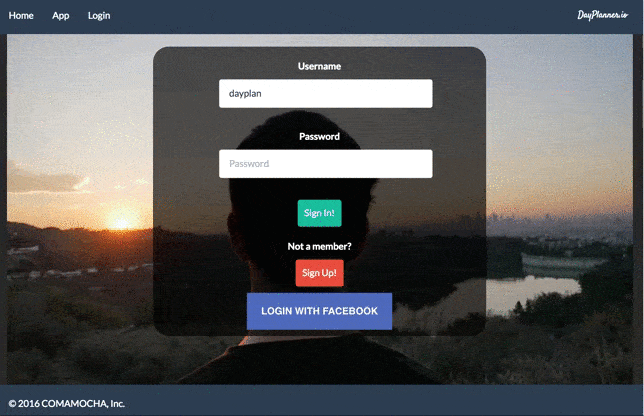

## Dayplan.us
Enable users to maximize free time through collaborative itineraries. 

Leverages Google MAPS and Yelp API to plan your itenerary. 



Checkout the [Live Website](http://dayplan.us).


##Stack

###Frontend
React v15.0

https://facebook.github.io/react/blog/2016/04/07/react-v15.html


###Backend
Node and Express with MYSQL database. 


##Testing Framework
###Enzyme 
[Enzyme] (https://github.com/airbnb/enzyme) is a JavaScript Testing utility for React that makes it easier to assert, manipulate, and traverse your React Components' output.


####What
 We choose to use Enzyme with Mocha and Chai. 

####Why
Testing a React application is not a trivial task. We explored other options: Jest, Mocha , Manual testing. Enzyme proved to be  straightforward a robust enough for our needs.

##Developer

To start the client

```
npm install
npm start

```

---


ComaMocha 2016 


